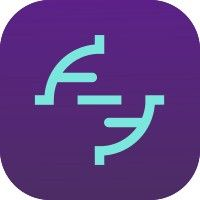
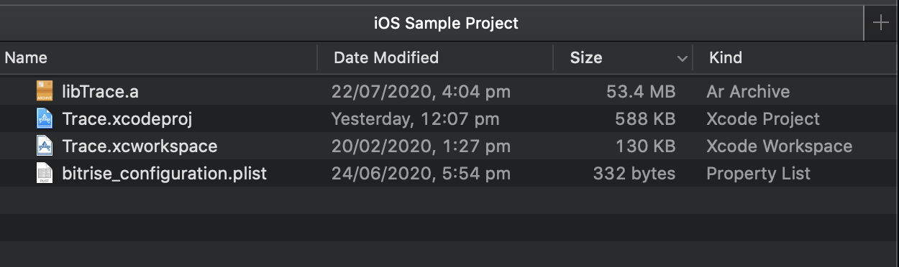
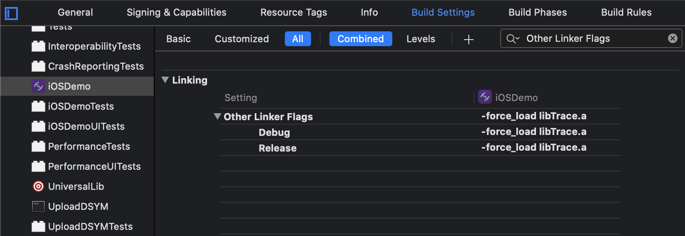
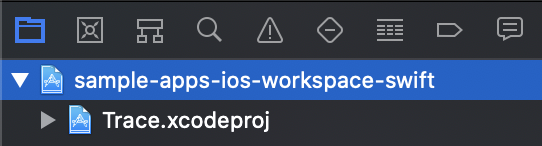
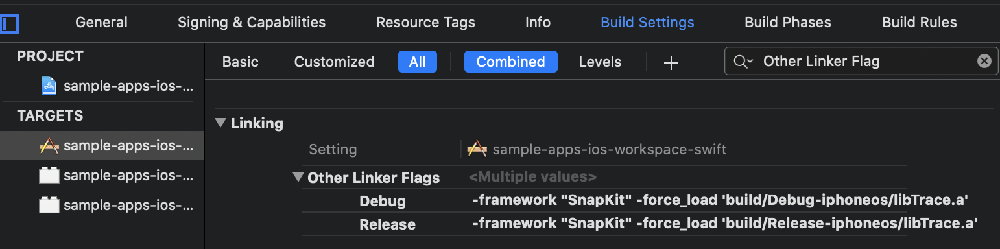
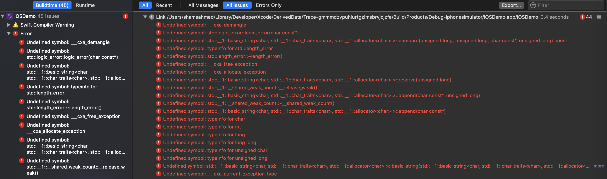
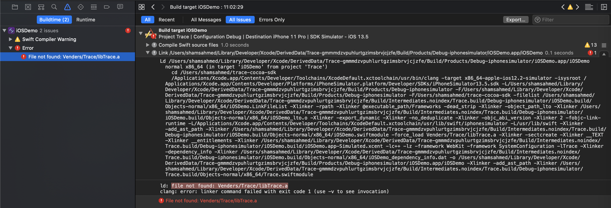
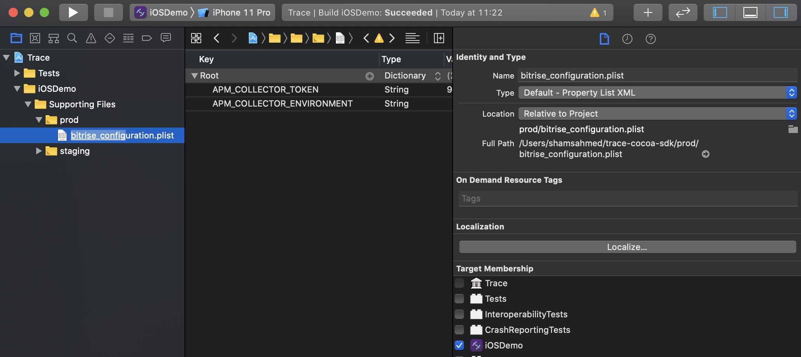

# [](https://www.bitrise.io/add-ons/trace-mobile-monitoring)  Trace SDK
[](https://app.bitrise.io/app/fa31931683b0dd17#/builds)[](https://cocoapods.org/pods/BitriseTrace)[](https://github.com/bitrise-io/trace-cocoa-sdk/blob/main/LICENSE)[](https://twitter.com/bitrise)[](https://chat.bitrise.io/)[](https://bettercodehub.com/results/bitrise-io/trace-cocoa-sdk)[](https://sonarcloud.io/dashboard?id=bitrise-io_trace-cocoa-sdk)

Catch bugs before they reach production — get detailed crash reports and monitor how your app is performing across the entire install base. When issues are detected we show you exactly what happened during the user session to locate, reproduce, and fix the problem as quickly as possible.
Use Trace to:
- **Detect the problem**: Know about issues before your users report them.
- **Assess the impact**: Focus on resolving the issues which are most impactful to your users.
- **Trace the cause**: Spend less time trying to reproduce issues.

* [What's Trace?](https://www.bitrise.io/add-ons/trace-mobile-monitoring)

*Note: Following links requires the user to be signed-in and have the Trace addon*  
  
[* Trace](https://trace.bitrise.io) [* Trace configuration settings](https://trace.bitrise.io/settings)

## Requirements

- iOS 10.0+ 
- [Xcode](https://apps.apple.com/gb/app/xcode/id497799835?mt=12) 11.0+
- Swift 5

## Installation

`Trace` SDK doesn't contain any external dependencies but does depend on a few system frameworks such as:      
* `SystemConfiguration.framework`
* `libc++.tbd`
* `libz.tbd`

Each framework can be found in Xcode's framework list. Current supported integration options are the following:

### Bitrise Workflow

### Install using [Bitrise workflow step: Add Trace SDK](https://www.bitrise.io/integrations/steps/add-trace-sdk)

Use *[Add trace SDK](https://www.bitrise.io/integrations/steps/add-trace-sdk)* step to add the SDK to your project automatically. All the downloads, linking SDK and supporting system framework and libraries are done for you. The step **must** come before the `Xcode Archive & Export step` as it has to be linked beforehand.

### Install directly from the source code

Add the following step inside your `bitrise.yml` file if the step project is in the repo folder

```yml
- path::./step/:
    title: Add Trace SDK to Xcode project
    inputs:
    - lib_version: "latest"
```

If you are using GIT use the following:
```yml
- git::https://github.com/bitrise-steplib/bitrise-step-add-trace-sdk.git@master:
    title: Add Trace SDK to the Xcode project
    inputs:
    - project_path: "$BITRISE_PROJECT_PATH"
    - scheme: "$BITRISE_SCHEME"
    - lib_version: latest
```

Note: the parameter `latest` will always use the most recent stable version of the SDK.

### [CocoaPods](https://guides.cocoapods.org/using/using-cocoapods.html)
Optional: Setup pod
```bash
$ pod init
```

Add Trace SDK to the `Podfile`
```ruby
# Podfile

target 'YOUR_TARGET_NAME' do
    pod 'BitriseTrace'
end
```

Replace `YOUR_TARGET_NAME` and then, in the `Podfile` directory, type:

```bash
$ pod install
```

Optional: Add `-force_load` to the SDK, if your project does not use `-ObjC` in `other linker flags`. This is used to make sure the SDK is launched at the start of the app.

* Select your application project in the Project Navigator (blue project icon) to navigate to the target configuration window and select the application target under the "Targets" heading in the sidebar.
* In the tab bar at the top of that window, open the "Build Settings" panel.
* Search for `Other Linker Flags` or `OTHER_LDFLAGS` and enter:

```bash
# When not using `use_frameworks!` i.e Static library approach 
-force_load $(TARGET_BUILD_DIR)/BitriseTrace/libBitriseTrace.a

# When using `use_frameworks!` i.e Framework approach
-force_load $(TARGET_BUILD_DIR)/BitriseTrace/Trace.framework/Trace

```

Now that the SDK is set up in your workspace, add the collector token (`bitrise_configuration.plist`) found in the [setting page](https://trace.bitrise.io/settings). Make sure this file is added to your application target.

### [Carthage](https://github.com/Carthage/Carthage)

Note: Cartage is not currently supported out of the box and requires a few steps to make it run. Please follow [integration steps](https://github.com/Carthage/Carthage/issues/2534).
Wait for [].xcframework support](https://github.com/Carthage/Carthage/pull/2881)

Add this to your `Cartfile`

```ruby
github "bitrise-io/trace-cocoa-sdk"
```

```bash
$ carthage update
```
Once you have included the library in your Xcode project:
* Select your application project in the Project Navigator (blue project icon) to navigate to the target configuration window and select the application target under the "Targets" heading in the sidebar.
* In the tab bar at the top of that window, open the "Build Settings" panel.
* Search for `Other Linker Flags` or `OTHER_LDFLAGS` and enter `-force_load '$(BUILT_PRODUCTS_DIR)/libTrace.a'`
* And that's it!

#### Carthage as a Static Library

Carthage defaults to building `Trace` as a Dynamic Library. 

If you wish to build `Trace` as a Static Library using Carthage you may use the script below to manually modify the framework type before building with Carthage:

```bash
carthage update `Trace` --platform iOS --no-build
sed -i -e 's/MACH_O_TYPE = mh_dylib/MACH_O_TYPE = staticlib/g' Carthage/Checkouts/Trace/Trace.xcodeproj/project.pbxproj
trace build Trace --platform iOS
```

### [Swift Package Manager (SPM)](https://swift.org/package-manager) (iOS and Mac Catalyst compatible)
The Swift Package Manager is a tool for automating the distribution of Swift code and is integrated into the swift compiler.

**Add the library to your project using one of the following methods:**

**Using `Package.swift` with Swift CLI**

```swift
dependencies: [
    .package(url: "https://github.com/bitrise-io/trace-cocoa-sdk.git", .upToNextMajor(from: "1.7.36"))
]
```
Add Trace SDK as a dependency inside your `Package.swift` file. Please look at the [release section](https://github.com/bitrise-io/trace-cocoa-sdk/releases) for the latest stable version of the SDK.

**Using Xcode Swift package manager integration**  

To add a package dependency to your Xcode project/workspace, select `File > Swift Packages > Add Package Dependency` and enter the repository URL `https://github.com/bitrise-io/trace-cocoa-sdk.git`. 

Also, you can also navigate to your target’s General pane, and in the “Frameworks, Libraries, and Embedded Content” section, click the + button, select Add Other, and choose Add Package Dependency.

**Optional: Only required if the project does not build**
**Adding `Other Linker Flags to application target**
* Select your application project in the Project Navigator (blue project icon) to navigate to the target configuration window and select the application target under the "Targets" heading in the sidebar.
* In the tab bar at the top of that window, open the "Build Settings" panel.
* Search for `Other Linker Flags` or `OTHER_LDFLAGS` and enter `-ObjC -l z -l c++`

Note: These flag make sure your project includes the required system frameworks to help with building the project.

**Calling Trace initializer**

In your project add `import Trace` and call `let trace = Trace.shared` to start the SDK.

* And that's it!

### [Manual](https://developer.apple.com/library/archive/documentation/ToolsLanguages/Conceptual/Xcode_Overview/WorkingonRelatedProjects.html#//apple_ref/doc/uid/TP40010215-CH33-SW1)

If you prefer not to use any of the aforementioned dependency managers, you can integrate `Trace` into your project manually.

#### Embedded static library at build time

* Download `libTrace.a` static library assert from [Github release page](https://github.com/bitrise-io/trace-cocoa-sdk/releases). Please select the first file under asset's called `libTrace.a`.
* Drop the library at the root of your Xcode project. i.e same directory as your `xcproject/xcworkspace` project.



* Next in Xcode, select your application project in the Project Navigator (blue project icon) to navigate to the target configuration window and select the application target under the "Targets" heading in the sidebar.
* Now, In the tab bar at the top of that window, open the "Build Settings" panel.
* Search for `Other Linker Flags` or `OTHER_LDFLAGS` and enter `-force_load libTrace.a`



`Note: The code snippet assumes the library is in the same directory as your `xcproject/xcworkspace` project.` If you use a different location add the new path.

* Click on the + button under the "Frameworks, Libraries and Embedded Content" section.
* Add `libz.tbd` and `libc++.tbd`.
* And that's it!

#### Embedded Xcode project

* Open up Terminal, `cd` into your top-level project directory where Xcode project is stored.
* Add `Trace` as a git submodule by running the following command:

`$ git submodule add https://github.com/bitrise-io/trace-cocoa-sdk.git`

* Open the new `trace-cocoa-sdk` folder, and drag the `Trace.xcodeproj` (blue project file`.xcodeproj`) into the Project Navigator of your application's Xcode project. They should appear nested underneath your application's blue project icon. 



* Next, select your application project in the Project Navigator (blue project icon) to navigate to the target configuration window and select the application target under the "Targets" heading in the sidebar.
* In the tab bar at the top of that window, open the "General" panel.
* Click on the + button under the "Frameworks, Libraries and Embedded Content" section.
* Add `libTrace.a` library from the search list.
* Add `libz.tbd` and `libc++.tbd` as well.
* Now, In the tab bar at the top of that window, open the "Build Settings" panel.
* Search for `Other Linker Flags` or `OTHER_LDFLAGS` and enter `-force_load '$(BUILT_PRODUCTS_DIR)/libTrace.a'`



Note: don't worry about other attributes on the list.

* And that's it!

## Uploading dSYM's

### Bitrise workflow step
This step automatically uploads all dSYM's files created from Xcode archive. It uses the default Xcode path to find all dSYM files and upload all of them automatically.

Note: An app that submits a build to iTunes Connect whiles making use of bitcode feature will have to manually download all dSYM's files and upload using the upload dSYM script found on Github. Only once it has been processed by Apple which can take up to an hour. See instructions below

### All other dependency managers

After following the Trace SDK installation steps on the Xcode project/workspace select your `application target` and go to the `build phases` tab.

Select the plus button and add `New Run Script Phase`. Name it `Bitrise Trace SDK - Upload dSYM's`

Copy and paste the following code in the script section:
```
#!/bin/sh
set +o posix

echo "Bitrise Trace SDK - starting Upload dSYM's"

# See script header for more information - https://github.com/bitrise-io/trace-cocoa-sdk/blob/main/UploadDSYM/main.swift#L4

# Run script
/usr/bin/xcrun --sdk macosx swift <(curl -Ls --retry 3 --connect-timeout 20 -H "Cache-Control: max-age=604800" https://raw.githubusercontent.com/bitrise-io/trace-cocoa-sdk/main/UploadDSYM/main.swift)

# Script logs can be viewed in Xcode report navigator or Bitrise app build logs

echo "Bitrise Trace SDK - finished Upload dSYM's"
```

### iTunes Connect (Apps with Bitcode support)

You must first download the zipped dSYM's files from iTunes Connect under Activity->Build->Download dSYM.

Open Terminal app and run the following shell command:
*Remote script:*
```
/usr/bin/xcrun --sdk macosx swift <(curl -Ls --retry 3 --connect-timeout 20 -H "Cache-Control: max-age=604800" https://raw.githubusercontent.com/bitrise-io/trace-cocoa-sdk/main/UploadDSYM/main.swift) APM_APP_VERSION version_here APM_BUILD_VERSION build_version_here APM_DSYM_PATH path_to_folder_or_zip_file
```

*Local script:* 
```
/usr/bin/xcrun --sdk macosx swift main.swift APM_APP_VERSION version_here APM_BUILD_VERSION build_version_here APM_DSYM_PATH path_to_folder_or_zip_file
```

The API requires the following parameters:

`APM_APP_VERSION`: The app's version number found on iTunes Connect site or the `Info.plist` file. i.e 1.0.0
`APM_BUILD_VERSION`: The app's version number found on iTunes Connect site or the `Info.plist` file. i.e 123
`APM_DSYM_PATH`: Path to the DSYM folder or zip file.

Note: The script assumes the current shell working directory has the bitrise_configuration.plist file. Otherwise use 
`APM_COLLECTOR_TOKEN token_here`

`APM_COLLECTOR_TOKEN`: Trace token found in `bitrise_configuration.plist` or Trace->Settings.

And that's it!
When running a build if you go to the build log section you will see the results when it has finished. Look at for `Bitrise Trace SDK - Upload dSYM's`.

# [Storage](https://monitoring-sdk.firebaseapp.com/)

SDk binaries is hosted on Firebase, download the latest version [here](https://monitoring-sdk.firebaseapp.com/latest/libTrace.a) or download a specific version by adding the version details inside the [url](https://monitoring-sdk.firebaseapp.com/latest/libTrace.a) i.e https://monitoring-sdk.firebaseapp.com/{MAJOR.MINOR.PITCH}/libTrace.a

By default navigating to the root of the SDK site will always redirect to latest version.

# Common problems

#### C++ system library is not linked



* Click on the + button under the "Frameworks, Libraries and Embedded Content" section.
* Add `libz.tbd` and `libc++.tbd`.
* And that's it!

#### Can't find Trace library



This error is caused by Xcode not being able to locate Trace library. By default, our installation guide uses the easiest approach. To resolve this error go to `Other Linker Flags` or `OTHER_LDFLAGS` in your application target and enter `-force_load CORRECT_PATH_TO_libTrace.a'`

#### Can't find collector token



Make sure `bitrise_configuration.plist` is included in your project and the target membership is set to the correct one.

#### Can't find collector token

`[Bitrise:Trace/internalError] Bitrise configuration file is missing from Bundle.main`
`[Bitrise:Trace/internalError] Application failed to read the configuration file, all data will be cached until it's resolved`

Add the collector token (`bitrise_configuration.plist`) found in the [setting page](https://trace.bitrise.io/settings). Make sure this file is added to your application target.

# Limitations

#### `-force_load` and `-all_load`

`.XCFramework` does not currently allow developers to load a library at App launch. This only affects SPM packages only. No workaround are available right now.

#### Mac catalyst support 

Mac catalyst support is only available in SPM and Manual installations as we should `.XCFramework`. Using `lipo` to create a static library does not work since it cannot understand architecture that are similar but have a different flavor to support Mac's. 

# Miscellaneous

### Special thanks to
- Karl Stenerud [KSCrash](https://github.com/kstenerud/KSCrash/) crash reporting dependency, last commit: `f45a917d93928b32626f3268239c58a6cdd852bb`, branch: master, Pull request date: (1st Feb 2021)
- Zuikyo [iOS-System-Symbols](https://github.com/Zuikyo/iOS-System-Symbols) for providing a resources on OS symbols 

# License
Trace is released under the MIT license. See [LICENSE](https://github.com/bitrise-io/trace-cocoa-sdk/blob/main/LICENSE) for details.
